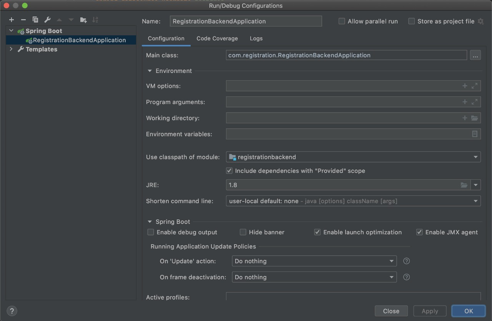

# RegistrationChallenge

### Documentação

* MER - mer.pdf

* Endpoints (Postman) - registration_application.postman_collection.json

### Pré-requisitos

Banco Postgres

* porta: 5432
* usuário: postgres
* senha: [sem senha]

Java 8

### Instalação

Clonar o repositório e seguir os passos:

Rodar os scripts de banco que estão no arquivo:

* database-scripts.sql

Rodar o pom.xml

```sh
$ cd backend/
$ mvn compile
$ mvn install
```

Configuração para rodar o java no intelliJ IDEA




Instalar os pacotes via npm ou yarn

```sh
$ cd frontend/
$ npm install
$ npm start
```

Acesso já configurado nos scripts do banco

usuário: admin

senha: 123456

usuário: comum

senha: 123456
